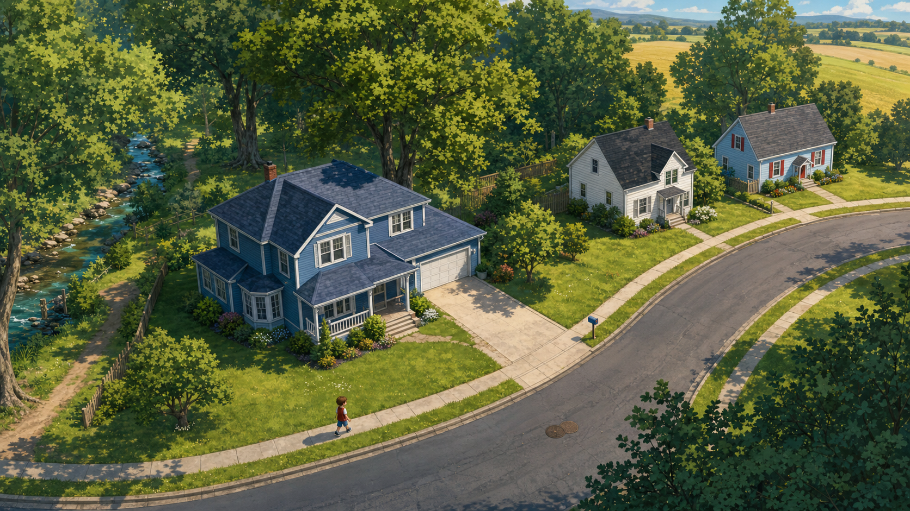
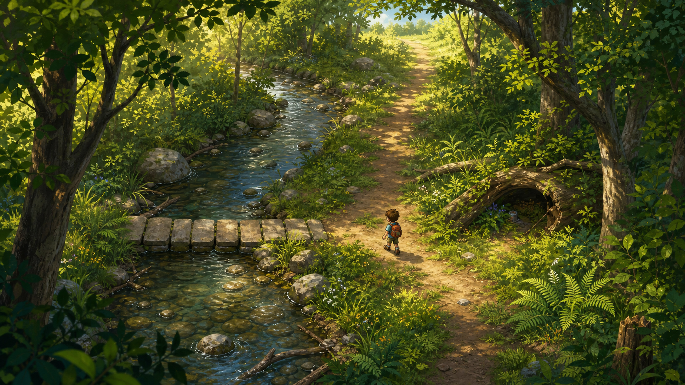
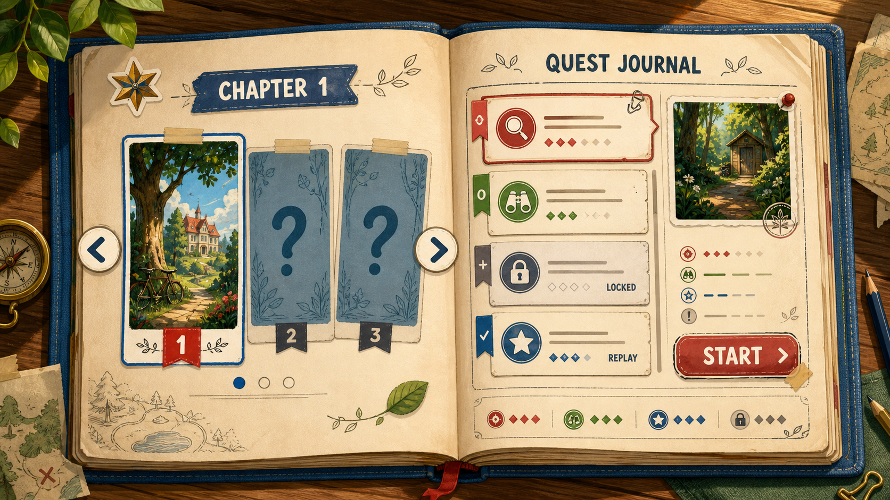
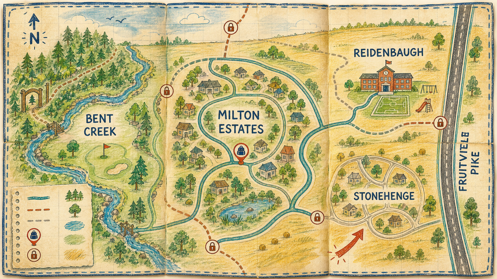

# Phase A visual targets: illustrated world and content browsing

Date: 2026-07-13  
Status: **awaiting visual approval — not production gameplay art**

These four targets establish the intended move from programmatic pixel shapes to HD illustrated 2D. They are deliberately fictionalized from the supplied regional aerial: they do not trace streets, lots, addresses, or private details. None is a collision map, a Tiled layer, or a source of quest coordinates.

## 1. Wheatfield Drive neighborhood gameplay frame

What to carry forward: the soft high-detail illustration, three-quarter camera, curving street, Billy's blue house/garage/broad drive, clear walkable edge, foliage depth, creek entrance, and distant-field context. The future production plate needs a HUD-safe top edge and foreground layers that can occlude Billy.

## 2. Creek Woods gameplay frame

What to carry forward: layered canopy foreground, readable water edge, stepping-stone landmark, generous pathing, hidden-item nook, and a visibly sunlit return route. The actual map needs its current stable interaction and transition IDs retained independently from this composition.

## 3. Chapter Scrapbook and Quest Journal browser

What to carry forward: a tactile open-book interaction with page arrows, visible chapter index, active/locked/completed states, selected quest detail, and a single primary action. The generated Chapter 1 thumbnail is a generic visual placeholder; the implemented browser must use real Chapter 1 content and selection data.

## 4. Backpack regional fold-out map

What to carry forward: north-up paper-map treatment, visual hierarchy, accessible versus locked route markings, player-area marker, and the regional relationship of Bent Creek west, Milton Estates center, Reidenbaugh northeast, Stonehenge east/southeast, and Fruitville Pike along the eastern edge. It establishes a dedicated regional map rather than a camera-rectangle map.

## Approval decision

Approve or revise each target separately. Approval enables Phase B's isolated Billy-house/Wheatfield Drive renderer slice; it does **not** approve changing quest logic, saves, stable map IDs, or full-map geography in the same checkpoint.

## Asset provenance

- Tool: built-in image generation
- Output format: 1672 × 941 PNG, saved as project review assets under `public/assets/concepts/phase-a/`
- Inputs: the provided annotated aerial informed broad regional relationships; `docs/art-direction.md` and the existing Chapter 1 concept informed the intended game presentation.
- Temporary status: concept-only. Cleaned backgrounds, image-layer chunks, object layers, and character sheets must be authored separately before implementation.
